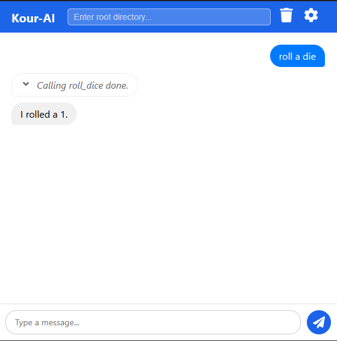

# Kour-AI

Your Windows desktop AI assistant for all file lookup, summarising, and instant chat needs.



Kour-AI is written in Electron to be cross platform, and is a budding application that is capable of interacting with system directories to parse files.

---

## Tech

Built with Tauri and React, Kour-AI is designed to be lightweight and efficient. It uses the OpenRouter API for AI capabilities and LibreOffice for document parsing.

## Installation and running

1. Create a fork of the repository

2. Download it via HTTP or ssh onto your system

3. Install dependencies

    ```shell
    cd kour-ai && npm install
    ```

4. Run the app

    ```shell
    npm run start
    ```

5. Build

    ```shell
    npm run make
    ```

### To run Kour-AI to its full potential, you will need the following

- An OpenRouter key: This is needed to make API calls for the AI

- LibreOffice: To allow the app to read `.pptx`, `.docx` formats
  - In particular, you will need to provide the app the link to the `soffice.com` file in the LibreOffice installation: `C:\Users\<path to LibreOffice>\App\libreoffice\program`
